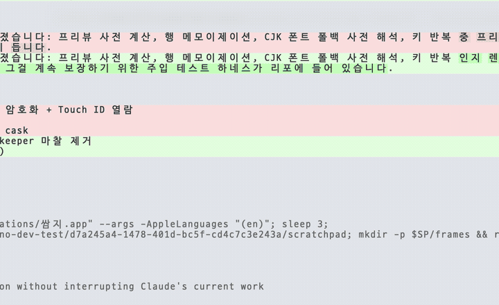
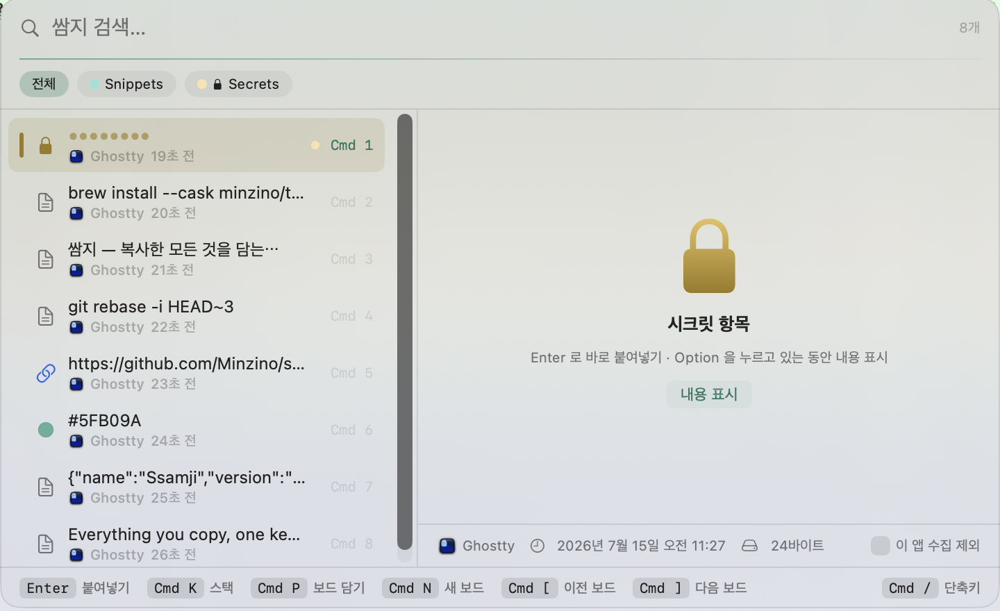

<p align="center">
  
</p>

<h1 align="center">쌈지 (Ssamji)</h1>

<p align="center">
  macOS 26이 애용하던 클립보드 앱을 부순 날, 직접 만들기 시작한 키보드 우선 클립보드 매니저.
  <br>
  <a href="README.md"><b>English README</b></a>
</p>

<p align="center">
  
</p>

쌈지는 귀한 것을 넣어 다니던 작은 주머니입니다. 이 쌈지는 복사한 모든 것을 담습니다 — 밀리초 만에 검색되고, 키 하나로 다시 붙여넣어지고, 허락 없이는 Mac 밖으로 한 발짝도 나가지 않습니다.

## 이런 게 됩니다

- **단축키 하나로 복사했던 모든 것.** `⌘⇧V`를 누르면 검색·리스트·프리뷰가 담긴 중앙 팔레트가 열립니다. 작업 중인 앱의 포커스를 뺏지 않는 패널이라, `Enter`를 누르면 커서가 있던 바로 그 자리에 붙습니다.
- **진짜로 찾아지는 검색.** trigram 기반 FTS5 전문 검색이라 단어 중간, URL 조각, 한글 어절 중간까지 부분 문자열로 잡힙니다. 검색은 디바운스되고 프리뷰는 미리 계산돼서 타이핑이 밀리는 일이 없습니다.
- **보드**에 아껴둘 것을 담으세요. 히스토리와 독립된 공간이라 히스토리를 비워도 보드 항목은 남습니다. `⌘N` 생성, `⌘P` 담기, `⌘[` / `⌘]` 이동.
- **시크릿 보드는 진짜 금고입니다.** 시크릿 보드에 들어간 항목은 디스크에서 암호화되고(AES-GCM, 키는 Keychain) 검색 인덱스에서도 지워집니다. 내용을 보거나 붙여넣으려면 **Touch ID**를 요구합니다. 라벨은 보이니까, 내용을 보지 않고도 무엇인지 알 수 있습니다.
- **페이스트 스택**: `⌘K`로 여러 개 담고 `⌘⏎`로 한 번에 — 줄바꿈·공백·콤마·`&&` 조인, 또는 `⌘V` 할 때마다 하나씩 나가는 순차 모드.
- **변환 붙여넣기** (`⌘T`): 대/소문자, 공백 정리, kebab-case, snake_case, JSON 프리티, 셸 이스케이프 등 — 원본은 그대로 둡니다.
- **iCloud 동기화(베타), 계정도 서버도 필요 없이.** iCloud Drive 폴더를 통해 내 Mac끼리 동기화합니다. 시크릿·이미지·파일은 동기화되지 않습니다. 기본은 꺼짐.
- **Paste에서 이주**: 보드·라벨·이미지까지 클릭 한 번에 가져옵니다.
- **주권 존중 설계**: 은신 모드(`⌘⇧E`)로 수집 즉시 중단, 앱별 수집 제외(`⌘E`), 보관 기간 1일~무제한, 비밀번호 관리자처럼 시스템이 민감 표시한 내용은 애초에 수집하지 않습니다.
- **한국어·영어** — 시스템 언어를 따릅니다.

팔레트에서 `⌘/`를 누르면 전체 단축키 사전이 열립니다.

<p align="center">
  
</p>

## 설치

**macOS 15.4 이상**이 필요합니다.

### Homebrew

```bash
brew install --cask minzino/tap/ssamji --no-quarantine
```

> 아직 자체 서명 배포라 `--no-quarantine`이 필요합니다. 공증 빌드가 나오면 없어집니다.

### 직접 다운로드

[Releases](https://github.com/Minzino/ssamji/releases)에서 `Ssamji-x.y.z.zip`을 받아 압축을 풀고 **쌈지.app**을 `/Applications`에 드래그하세요. 첫 실행만 **우클릭 → 열기**로 (자체 서명 빌드).

### 소스 빌드

```bash
git clone https://github.com/Minzino/ssamji.git
cd ssamji
./scripts/bundle.sh   # 빌드 + 서명 + /Applications 설치 + 재시작
```

### 첫 실행 권한

1. **클립보드 접근** — 시스템 설정 → 개인정보 보호 및 보안에서 쌈지를 *항상 허용*으로 (macOS 26).
2. **손쉬운 사용** — 다이렉트 붙여넣기(`⌘V` 합성)에 필요합니다. 없으면 `Enter`가 복사만 합니다.

## 프라이버시

모든 데이터는 `~/Library/Application Support/Ssamji/`에 있습니다. 계정 없음, 분석 없음, 네트워크 호출 없음 — 선택 기능인 iCloud 동기화도 *내* iCloud Drive에 파일을 쓸 뿐입니다. 시크릿 보드 내용은 Mac의 Keychain을 벗어나지 않는 키로 디스크에서 암호화되며, 그래서 시크릿은 동기화에서도 제외됩니다.

## 성능

쌈지는 "렉 금지 계약" 위에서 만들어졌습니다: 프리뷰 사전 계산, 행 메모이제이션, CJK 폰트 폴백 사전 해석, 키 반복 인지 렌더링. Apple silicon에서 수백 개 스크롤·보드 전환이 프레임 예산 안에 들고, 그걸 계속 보장하기 위한 주입 테스트 하네스가 리포에 들어 있습니다.

## 로드맵

- 공증 릴리스 (Developer ID) — Gatekeeper 마찰 제거
- CloudKit 동기화 승격 (실시간 푸시)
- frecency 정렬

## 라이선스

[MIT](LICENSE)
