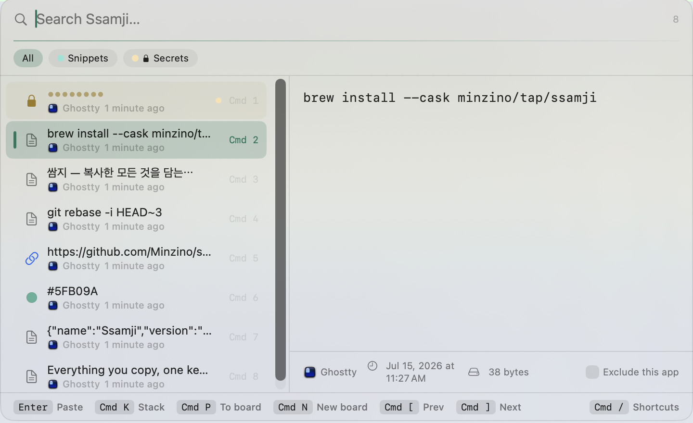

<p align="center">
  
</p>

<h1 align="center">Ssamji (쌈지)</h1>

<p align="center">
  A fast, keyboard-first clipboard manager for macOS — born the day macOS 26 broke my favorite one.
  <br>
  <a href="README.ko.md"><b>한국어 README</b></a>
</p>

<p align="center">
  
</p>

A *ssamji* is a traditional Korean pouch for carrying small, precious things. This one carries everything you copy — searchable in milliseconds, pasted back with a single keystroke, and never leaving your Mac unless you ask it to.

## Highlights

- **One shortcut, everything you copied.** `⌘⇧V` opens a central palette with search, list, and a rich preview. It's a non-activating panel, so the app you're working in never loses focus — press `Enter` and the clip lands right where your cursor was.
- **Search that actually finds things.** SQLite FTS5 with a trigram tokenizer means substring matching that works mid-word, mid-URL, and mid-Korean-syllable. Typing never lags: search is debounced and previews are precomputed.
- **Boards** keep your keepers. Collections that live outside history — clear your history freely, board items stay. Create with `⌘N`, file things away with `⌘P`, hop between boards with `⌘[` / `⌘]`.
- **Secret boards are actual vaults.** Items in a secret board are encrypted at rest (AES-GCM, key in your Keychain) and wiped from the search index. Revealing or pasting one asks for **Touch ID**. Labels stay visible so you know what's inside without seeing what's inside.
- **Paste stack** for multi-part work: collect clips with `⌘K`, then `⌘⏎` pastes them joined by newlines, spaces, commas, `&&` — or one at a time, advancing on every `⌘V`.
- **Transform paste** (`⌘T`): UPPERCASE, lowercase, trim, kebab-case, snake_case, pretty-printed JSON, shell-escaped, and other terminal-friendly shapes — original stays untouched.
- **iCloud sync (beta), no account required from you or me.** Ssamji syncs between your Macs through a plain iCloud Drive folder. Secrets, images, and files never sync. Off by default.
- **Migrate from Paste** in one click — boards, labels, and images included.
- **Respectful by design**: stealth mode (`⌘⇧E`) pauses collection instantly, per-app exclusions (`⌘E`), retention from 1 day to forever, and concealed content (password managers) is never collected at all.
- **English and Korean**, following your system language.

Press `⌘/` inside the palette for the full shortcut reference.

<p align="center">
  
</p>

## Install

Requires **macOS 15.4 or later**.

### Homebrew

```bash
brew install --cask minzino/tap/ssamji --no-quarantine
```

> `--no-quarantine` is needed because releases are currently self-signed. It will no longer be necessary once notarized builds ship.

### Direct download

Grab `Ssamji-x.y.z.zip` from [Releases](https://github.com/Minzino/ssamji/releases), unzip, drag **쌈지.app** into `/Applications`, then **right-click → Open** the first time (self-signed build).

### Build from source

```bash
git clone https://github.com/Minzino/ssamji.git
cd ssamji
./scripts/bundle.sh   # builds, signs, installs to /Applications, relaunches
```

### First-run permissions

1. **Clipboard access** — System Settings → Privacy & Security → set Ssamji to *Always Allow* (macOS 26).
2. **Accessibility** — powers direct paste (synthesized `⌘V`). Without it, `Enter` copies instead of pasting.

## Privacy

Everything lives in `~/Library/Application Support/Ssamji/`. No accounts, no analytics, no network calls — the optional iCloud sync writes files to *your* iCloud Drive and nowhere else. Secret-board content is AES-GCM encrypted on disk with a key that never leaves your Mac's Keychain, which is also why secrets are excluded from sync.

## Performance

Ssamji is built against a strict no-jank contract: precomputed previews, memoized rows, CJK font-fallback pre-resolution, and key-repeat-aware rendering. Scrolling hundreds of items or switching boards stays within a frame budget on Apple silicon — and there's an in-repo injection harness to prove it stays that way.

## Roadmap

- Notarized releases (Developer ID) — removes the Gatekeeper friction
- CloudKit sync upgrade with real-time push
- Frecency-based ranking

## License

[MIT](LICENSE)
